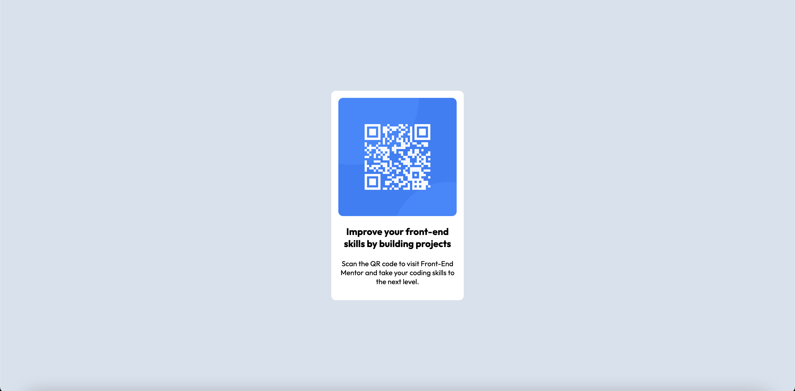

# Frontend Mentor - QR code component solution

This is a solution to the [QR code component challenge on Frontend Mentor](https://www.frontendmentor.io/challenges/qr-code-component-iux_sIO_H). Frontend Mentor challenges help you improve your coding skills by building realistic projects. 

## Table of contents

- [Overview](#overview)
  - [Screenshot](#screenshot)
  - [Links](#links)
- [My process](#my-process)
  - [Built with](#built-with)
  - [What I learned](#what-i-learned)
- [Author](#author)

**Note: Delete this note and update the table of contents based on what sections you keep.**

## Overview

I haven't coded in HTML and CSS in a long time, so this project helped me get back in the workflow and start learning new stuff. This was relatively simple to do.

### Screenshot

### Links

- Solution URL: [Add solution URL here](https://your-solution-url.com)
- Live Site URL: [Add live site URL here](https://your-live-site-url.com)

## My process
 1. Did the HTML first
 2. Made the holder div
 3. Added the image
 4. Made the title
 5. Made the paragraph
 6. Then CSS styling.
 7. Used flexbox to align the holder div to the center
 8. Used flexbox *inside* the holder div to align everything to the center.
 9. Used CSS to change the fonts and the image size. The end result was small enough to be able to fit on most phones with no extra code for responsiveness.
### Built with

- Semantic HTML5 markup
- CSS custom properties
- Flexbox
- Desktop-first workflow

### What I learned

I didn't learn things so much as recap things I knew before. This just helped me find my groove and got me excited for front end development again.

## Author

- Frontend Mentor - [@Cyclone3603](https://www.frontendmentor.io/profile/Cyclone3603)
- Reddit - [u/Ghost3603](https://www.reddit.com/user/Ghost3603)
